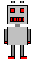
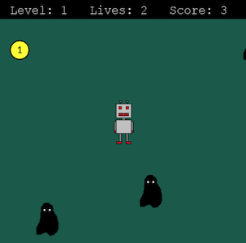

   
# Rich Robot

This a project completed as part of the **[Python Programming MOOC](https://programming-23.mooc.fi/)** run by The University of Helsinki.

## The brief

To create a small game with Pygame which should contain the following features:

- The game has a sprite the player can move in some way
- The game has some collectable items and/or enemies
- The player needs to be set a clear task in the game
- The game contains a counter which tells the player how they are doing in the game
- The source code for the game is divided into functions like in the Sokoban example

## Rich Robot

The game is a retro-style coin collecting game in which the player controls a robot using the arrow keys, and has to collect coins whilst avoiding monsters which increase in number and velocity, and come from more directions, as the game progresses.

## Screenshot

